<div align="center">


<p>
  
  
  
  
  
  
  
</p>

<p>
  <a href="https://bittencourtthulio.github.io/expxdev/#ecossistema"><strong>📘 Documentação do método</strong></a>
  &nbsp;·&nbsp;
  <a href="#os-quatro-estágios">Estágios M0–M3</a>
  &nbsp;·&nbsp;
  <a href="#as-três-injeções">As três injeções</a>
  &nbsp;·&nbsp;
  <a href="#o-contrato-o-que-é-um-módulo">O contrato</a>
  &nbsp;·&nbsp;
  <a href="#o-ecossistema-expx">O ecossistema</a>
  &nbsp;·&nbsp;
  <a href="#instalação">Instalação</a>
</p>

<strong>A camada de conhecimento de módulos do método Expx</strong> — o que já foi<br>
resolvido volta antes de ser redescoberto, para <a href="https://claude.com/claude-code">Claude Code</a> e <a href="https://opencode.ai">OpenCode</a>.

</div>

`modulex` (lê-se "módulo elevado a x") é o catálogo de problemas já resolvidos. Ele não planeja, não implementa e não decide: carrega conhecimento pronto sobre integrações que alguém já fez, para que a `sprintx` e a `runx` não redescubram a mesma coisa a cada projeto. Ele responde a pergunta que nenhuma skill irmã faz: **alguém já resolveu isso antes?**

> **O módulo é um problema resolvido, não uma biblioteca.**
> A chave de busca é o problema na linguagem de quem pede — "atender cliente por WhatsApp", "cobrar cartão recorrente" — nunca o nome do fornecedor. Buscar por `uazapi` tem que funcionar; buscar por `whatsapp` tem que funcionar **melhor**.

---

## Veja acontecendo

Descreva o problema. **Não é preciso dizer `modulex`, "módulo" nem "catálogo"** — a skill dispara sozinha quando o trabalho envolve integrar um terceiro, consulta o catálogo antes de a `sprintx` planejar, e devolve a feature entregue como módulo novo:

<p align="center">
  
</p>

```bash
npx expxdev init          # instala a modulex e o resto do método no seu harness
```

```

Preciso que o sistema atenda cliente pelo WhatsApp.
```

A consulta leu **um arquivo**, sem rede. A injeção puxou mais um. Os cento e cinquenta artefatos do módulo só descem na F6, task a task, sob TDD — e nunca antes.

---

## Por que existir

Toda vez que um projeto precisa de WhatsApp, pagamento, storage, email transacional ou nota fiscal, a `sprintx` repete a mesma descoberta: ler a documentação da API, descobrir os limites, tropeçar nos mesmos erros conhecidos, e produzir um plano que já foi produzido antes, em outro cliente.

Isso queima tokens, queima tempo e produz planos de qualidade desigual. E o efeito é contraintuitivo: **o terceiro projeto que integra a mesma coisa costuma sair pior que o primeiro**, porque quem fez o primeiro aprendeu na marra e esse aprendizado não voltou para lugar nenhum.

A `modulex` é o lugar onde ele volta. O que a torna diferente de uma pasta de snippets:

- **A chave é o problema, não o fornecedor** — a busca entende "inbox de atendimento" e "disparo de mensagem", não só `uazapi`.
- **Cada bloco chega com a autoridade declarada** — plano é rascunho, decisão é pauta, armadilha é hipótese, artefato é para copiar. Sem essa marca, a casa de origem entra por omissão.
- **A stack vem separada em duas colunas** — o que é exigência do terceiro viaja; o que é convenção da casa de origem fica.
- **O que o módulo NÃO cobre é campo obrigatório** — a metade que todo mundo esquece é a que evita descobrir o buraco no meio da execução.
- **Campo não verificável é `NAO DETERMINADO`** — módulo com faixa de esforço inventada é pior que módulo inexistente.
- **O ciclo fecha sozinho até a metade** — um hook enfileira candidato ao fim da entrega, com a parte mecânica já preenchida.
- **Nada bloqueia** — sem catálogo, sem rede, sem módulo: a `sprintx` planeja do zero como sempre planejou.

---

## Os quatro estágios

```

M0 CONSULTA → M1 INJEÇÃO → [a feature] → M2 EXTRAÇÃO → e de volta à M0
                                              ↑
                                     M3 VERIFICAÇÃO
```

O custo é o desenho inteiro: a operação mais frequente tem que ser a mais barata, ou ninguém usa e a skill morre.

<p align="center">
  
</p>

A máquina de estados, com o que faz cada transição acontecer:

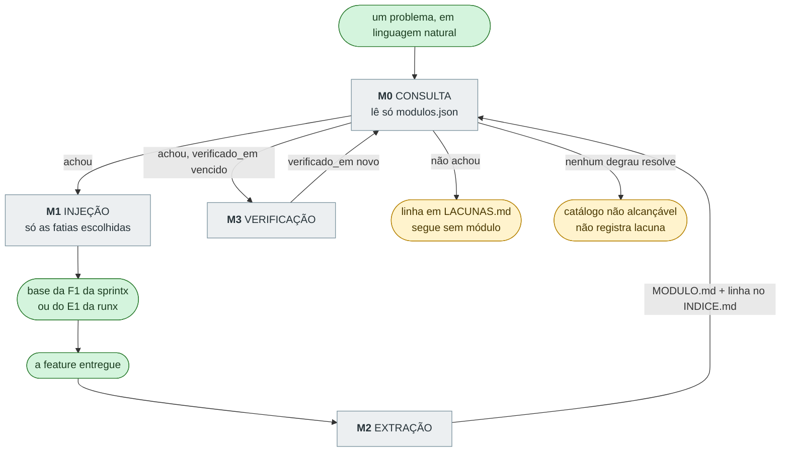

| Estágio | Nome | O que faz |
|---|---|---|
| **M0** | Consulta | A operação **mais frequente** e a que precisa ser barata: dado um problema em linguagem natural, existe módulo, e que fatias ele tem? Responde no chat, não gera arquivo. Lê **apenas `modulos.json`** — nunca clona repositório de módulo, nunca abre artefato. |
| **M1** | Injeção | Carrega o `MODULO.md` — e **só as fatias escolhidas** — na base de conhecimento de um trabalho em andamento, no formato que a F1 da `sprintx` ou o E1 da `runx` espera. Cada bloco chega marcado com a autoridade que terá adiante. |
| **M2** | Extração | O caminho inverso, e **o que faz o catálogo crescer**: uma feature terminada que integrou um terceiro vira módulo novo, a partir dos artefatos que a `sprintx` e a `mergex` já produziram. É o estágio que fecha o ciclo. |
| **M3** | Verificação | O módulo envelhece: API muda, limite muda, erro some. Prazos por tipo de campo — 6 meses para o contrato da API, 12 para o plano e a stack, 24 para o problema e os sinônimos. O `verificado_em` é a data **mais antiga** entre os campos, conservador de propósito. |

**Módulo desatualizado é pior que módulo nenhum.** Sem módulo, a `sprintx` lê a documentação atual e acerta; com módulo vencido, ela produz um plano confiante e errado — depois de o P4 da `prodx` já ter encolhido o escopo com base numa faixa que não vale mais.

### Comandos

| Comando | O que faz |
|---|---|
| `/modulex` | estado do catálogo: quantos módulos, quantos com verificação vencida, lacunas mais pedidas |
| `/modulex-buscar <problema>` | **M0** — consulta por problema em linguagem natural |
| `/modulex-injetar <id>` | **M1** — carrega um módulo (ou fatias dele) na base do trabalho atual |
| `/modulex-extrair <feature>` | **M2** — cria um módulo novo a partir de uma feature entregue |
| `/modulex-verificar <id>` | **M3** — revalida um módulo contra a realidade atual da API |
| `/modulex-publicar <arquivo>` | publica um `MODULO.md` no catálogo via PR, com o gate rodando **antes** do push |
| `/modulex-sincronizar` | puxa o catálogo do GitHub para a cópia local — o único ponto que toca a rede |

---

## As três injeções

O coração do desenho, e a parte que não se pode simplificar: a `modulex` entrega coisas diferentes para cada skill, com **autoridade diferente**. A mesma informação que é rascunho na `sprintx` é sinal na `prodx` e hipótese na `runx`.

<p align="center">
  
</p>

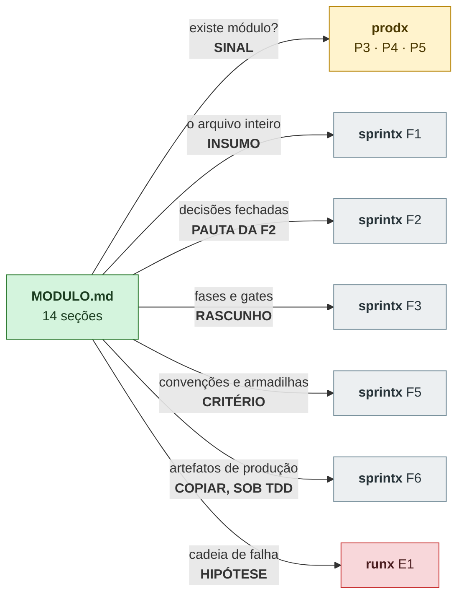

### Por que a autoridade muda de ponto para ponto

Na **prodx**, um módulo pronto **não** é evidência de que o sistema já faz aquilo. Se fosse tratado como tal, o P3 devolveria `ja_existe` para uma funcionalidade que ninguém instalou — e o cliente receberia um texto explicando onde encontrar uma tela que não existe. Esse erro volta pelo atendimento, que é o caminho mais caro. O que o módulo prova é outra coisa: que **o custo é menor do que parece**, o que muda o P4, não o P3.

Na **runx**, a cadeia de falha é a melhor lista de suspeitos que existe — e continua sendo suspeita. O E1 exige prova, e "o módulo diz que costuma ser a permissão faltando" não é prova. É onde olhar primeiro.

Na **sprintx**, o plano lido como decidido faz a F2 não perguntar o que precisa perguntar, e a casa de origem entra por omissão.

> A `buildx` tem uma particularidade que nenhuma outra tem: ela faz **uma única pergunta** ao humano, no começo, e a M1 por desenho **pergunta** quais fatias injetar. Os dois não podem estar certos ao mesmo tempo. A resolução é a `buildx` responder no lugar do humano, derivando do `MAPA.md` e registrando como premissa antes de usar — e, não sendo derivável, injetar **só o núcleo**. Injetar tudo é proibido: errar para menos custa uma injeção a mais; errar para mais custa um projeto inteiro planejado a mais.

---

## Plano e artefato: regras opostas

O módulo carrega dois tipos de conteúdo, e confundi-los é o erro mais caro que se pode cometer com esta skill.

<p align="center">
  
</p>

| Tipo | O que é | Como a `sprintx` trata |
|---|---|---|
| **Plano** | sprints, fases, gates, ordem de execução | **rascunho a adaptar** — a F3 continua produzindo o plano real deste projeto |
| **Artefato** | migration, função, componente que já rodou em produção | **copiar preferencialmente a reescrever** — reescrever perde correções invisíveis |

Reescrever um artefato de produção perde cicatriz: um `CREATE TABLE` retypado à mão perde o `GRANT` que existe porque, sem ele, o frontend recebe array vazio **e nenhum erro**. Nada quebra, nada aparece no log — a tela só fica vazia, e alguém perde uma tarde descobrindo por quê. Essa correção não está visível no código.

**Quando a origem é privada, a segunda metade não existe — e isso é declarado, nunca deduzido.** O módulo extrai a estrutura de que precisa, se basta, e não exige acesso nenhum à origem: a F6 constrói a partir do plano e das armadilhas, sob TDD. O que ele poupa é a **descoberta**, que é a maior parte do custo. O que ele não pode é deixar isso implícito, porque plano que conta com cópia que nunca chega descobre o buraco na metade da execução.

> **E copiar não dispensa o TDD.**
> O plano se adapta, o artefato se copia — e as duas coisas passam pela auditoria da F5 e pelo TDD da F6. Artefato copiado sem teste é dívida, não atalho.

---

## Essencial e herdado

**O maior risco da skill inteira.** Um módulo carrega stack e arquitetura acopladas ao sistema de onde foi extraído. Injetá-las inteiras num projeto que já tem as suas é colocar a casa de origem dentro da casa de destino — e o modo como isso acontece quase nunca é uma decisão, é **omissão**.

<p align="center">
  
</p>

Todo módulo separa a dependência de stack em duas colunas, e o teste é um só:

| Coluna | Teste | Viaja? |
|---|---|---|
| **essencial ao problema** | *se eu trocar isto, o terceiro para de funcionar?* → sim | **sim**, vale em qualquer projeto |
| **herdada do sistema de origem** | …não, só a casa de origem faz assim | **não**, o `stackx` do destino traduz |

No módulo zero: o webhook precisa ser público porque a Uazapi chama de fora — **essencial**. A formatação de telefone precisa preservar o JID de grupo — **essencial**, é regra do WhatsApp. Já o nome `company_id`, o formato de resposta `{success, data}` e a UI em pt-BR são **herança**: o destino pode chamar de `org_id`, responder em outro formato e falar outro idioma sem que nada quebre.

Conflito na coluna essencial é **reportado, não resolvido**: a `modulex` não escolhe entre a regra de segurança do projeto e a exigência do fornecedor. Ela mostra as duas e cala.

---

## O contrato: o que é um módulo

Um módulo é um repositório com um **`MODULO.md` na raiz**, frontmatter `expx-schema v1` e `kind: modulo`. Repositório sem `MODULO.md` não é módulo: é repositório com código dentro.

E o contrato não é norma escrita — é **teste que reprova merge**.

<p align="center">
  
</p>

| # | Seção | Por que existe |
|---|---|---|
| 1 | Problema que resolve | na linguagem de quem pede. É o que o P3 e a F1 procuram |
| 2 | Sinônimos e termos de busca | pt e en, o fornecedor, os termos da casa. Sem isso a busca falha por nomenclatura |
| 3 | Fatias | núcleo obrigatório e extensões opcionais |
| 4 | O que cobre e **o que NÃO cobre** | por fatia. A segunda metade é a mais valiosa e a que todo mundo esquece |
| 5 | Decisões de escopo já fechadas | **pauta da F2**, jamais fato consumado |
| 6 | Dependência de stack | em duas colunas: essencial × herdada |
| 7 | Pré-requisitos | cada um marcado como bloqueante ou não |
| 8 | Faixa de esforço observada | referência histórica, **não estimativa** |
| 9 | Plano de fases com gates | rascunho da F3, critério da F5 |
| 10 | Inventário de artefatos | com a marca de "rodou em produção" ou "exemplo" |
| 11 | Cadeia de falha e armadilhas | hipótese do E1 |
| 12 | Catálogo de erros | códigos, causa, retry |
| 13 | **Lacunas** | o que a documentação não responde e foi descoberto na marra |
| 14 | Procedência | de onde veio, de qual sistema, contra qual versão da API |

```bash
python3 scripts/validar_modulo.py --todos      # 14 secoes, schema, status, lacunas
python3 scripts/reindexar.py --conferir        # o indice bate com os MODULO.md
```

> **Regra dura:** campo não verificável vira `NAO DETERMINADO` e entra, obrigatoriamente, nas lacunas.
> Módulo com faixa de esforço inventada é **pior** que módulo inexistente, porque a `prodx` encolhe escopo com base em ficção.

### A seção 13 é o ativo

As lacunas são o que justifica o módulo existir. Documentação de API qualquer um lê. Que o webhook precisa responder 2xx mesmo para payload ignorado, sob pena de o provedor reenfileirar para sempre, ninguém lê — descobre-se depois de uma tarde perdida.

Um `MODULO.md` com a seção 13 vazia é um resumo de documentação, e resumo de documentação não vale o custo de manter.

---

## A esteira: o catálogo cresce até a metade sozinho

A M2 é o estágio que fecha o ciclo e é o que ninguém roda — não por preguiça, por custo. No fim de uma entrega, ninguém tem apetite para preencher catorze seções à mão.

Um hook resolve a metade barata desse custo. Ele **não extrai módulo: enfileira candidato.**

<p align="center">
  
</p>

| O script observa sozinho | Só sai com julgamento |
|---|---|
| **8** faixa de esforço — datas reais de commit | **13** as lacunas: o que se descobriu na marra |
| **10** inventário — arquivos e contagem | **4** o que **não** cobre |
| **7** pré-requisitos — variáveis de credencial | **6** essencial × herdado |
| **12** catálogo de erros — códigos tratados no código | **5** decisões, com a alternativa descartada |
| **14** procedência — branch, commit, data | **1** o problema na linguagem de quem pede |

A divisão é limpa porque o script é bom exatamente onde o humano é ruim. Datas de commit ninguém lembra duas semanas depois; o que quebrou e demorou para achar, nenhuma varredura encontra.

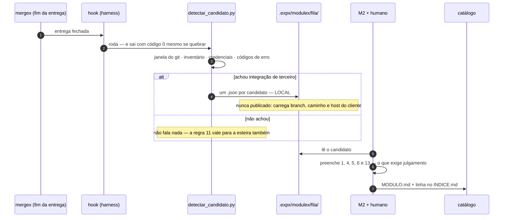

**A janela do git prova calendário, não esforço.** Ela só vira faixa de esforço quando um humano confirma que a janela corresponde ao trabalho — número de máquina não é mais verdadeiro que número de humano, é só mais fácil de acreditar.

**Candidato não é módulo.** Ele aparece na M0 marcado, porque a informação mais valiosa dele é que *ele existe*: manda conversar com quem fez, em vez de começar do zero. O que ele não pode é virar rascunho de sprint na F3 nem artefato copiado na F6.

---

## O catálogo em nuvem é o GitHub, e nada além dele

Sem servidor, sem banco, sem serviço próprio. Em cada ponto o primitivo nativo é melhor que a alternativa construída:

<p align="center">
  
</p>

| Peça | Construída | No GitHub |
|---|---|---|
| índice da M0 | banco | `modulos.json` por raw, com CDN na frente |
| busca | banco vetorial | lexical sobre os sinônimos; vetor **commitado** se um dia precisar |
| gate | serviço próprio | Actions no PR + secret scanning nativo |
| aprovação humana | fluxo inventado | **o PR já é a aprovação** |
| lacunas globais | tabela | **issues com label `lacuna`**, e 👍 como voto |
| vencimento | cron em servidor | Actions `schedule`, abrindo issue de M3 |

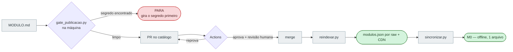

```bash
python3 scripts/gate_publicacao.py <arquivos>  # segredo, dado pessoal, dominio
```

**Extrair, não anonimizar.** Anonimizar falha aberto: o que o padrão não pegou vai junto, e em repositório público não volta. Extrair falha fechado: o que não está no schema nunca foi copiado. O gate é a última linha, não a primeira — e roda na máquina **antes** do push, porque push protection no remoto já é tarde.

**O que se perde, declarado:** telemetria de leitura agregada. A escrita se mede pelos PRs; a leitura, não.

---

## Como o projeto encontra o catálogo

O catálogo vive num **repositório irmão do ecossistema**, não em cada projeto. Estando dentro de um projeto qualquer, o endereço se resolve por uma **cadeia de quatro degraus** — pare no primeiro que existir:

<p align="center">
  
</p>

| # | Onde | Quando |
|---|---|---|
| 1 | `$MODULEX_CATALOGO/modulos.json` | override explícito de quem sabe o que está fazendo |
| 2 | `.expx/modulex/docs/modulos/modulos.json` | instalado no projeto pelo `npx expxdev init` |
| 3 | `docs/modulos/modulos.json` | você está dentro do próprio repositório do catálogo |
| 4 | nenhum | **catálogo não alcançável** — segue sem módulo, regra 11 |

Sem rede e sem caminho absoluto. O primeiro degrau vence inteiro: catálogo **não se funde**, porque dois `modulos.json` com o mesmo `id` e conteúdos diferentes é exatamente a ambiguidade que a skill existe para não criar.

Duas consequências que não são óbvias:

- **Toda saída da M0 declara de qual degrau leu e qual é o `atualizado_em`.** Custa uma linha e torna visível o defeito mais provável depois de instalada: consultar catálogo velho sem saber.
- **Catálogo não alcançável não é `NAO EXISTE`.** A primeira não registra lacuna, a segunda registra. Confundi-las polui o arquivo que decide a próxima extração com buscas que nunca foram feitas.

**Por que repositório irmão e não `docs/modulos/` de cada projeto:** módulo é ativo do ecossistema, não da casa. Um catálogo local nasceria vazio em todo projeto novo — exatamente onde o módulo mais valeria — e a extração feita no cliente A nunca chegaria ao cliente B. O ciclo não fecharia, e a skill viraria um `memox` com outro nome.

---

## O ecossistema Expx

O método Expx é um conjunto de skills que se compõem, instaladas e mantidas pelo CLI [`expxdev`](https://github.com/bittencourtthulio/expxdev). A `prodx` decide **se** há trabalho; a `sprintx` decide **como** fazê-lo; as camadas modificam o comportamento dela; a `mergex` entrega; a `buildx` orquestra o projeto inteiro por cima de tudo:

<p align="center">
  
</p>

| Peça | Papel | Relação com a `modulex` |
|---|---|---|
| **[expxdev](https://github.com/bittencourtthulio/expxdev)** | o CLI: instala, atualiza e diagnostica o ecossistema, e sobe o painel de operação | é quem instala esta skill (`npx expxdev init`) |
| **[sprintx](https://github.com/bittencourtthulio/sprintx)** | **Build** — feature nova, F1…F6 | o consumidor principal: consulta na F1, pauta na F2, rascunho na F3, auditoria na F5, artefatos na F6 |
| **[runx](https://github.com/bittencourtthulio/runx)** | **Run** — ocorrência em produção, E1…E5 | a cadeia de falha e o catálogo de erros entram no E1 como **hipótese a comprovar** |
| **[legadox](https://github.com/bittencourtthulio/legadox)** | **camada** de segurança para código legado | fica acima da `modulex` na precedência: na área tocada, o padrão local manda |
| **[stackx](https://github.com/bittencourtthulio/stackx)** | **camada** de convenções do repositório | **o stackx local vence** a convenção herdada do sistema de origem do módulo |
| **[mergex](https://github.com/bittencourtthulio/mergex)** | entrega: branch, commit por task, PR e pacote de QA | o relatório de entrega é insumo da extração — é dele que sai a faixa de esforço observada |
| **[memox](https://github.com/bittencourtthulio/MemoX)** | **camada** de memória do projeto | indexa problema, sinônimos e lacunas do catálogo, e é o que faz a consulta melhorar com o tempo |
| **[prodx](https://github.com/bittencourtthulio/prodx)** | **camada** de produto: decide **se** há trabalho | ganha um sexto lugar de busca no P3 e as fatias que dimensionam o escopo mínimo no P4 |
| **modulex** *(este repositório)* | **camada** de conhecimento de módulos, M0…M3 | — |
| **[buildx](https://github.com/bittencourtthulio/buildx)** | orquestra um projeto inteiro, da descrição ao sistema pronto | consome a `modulex` pela `sprintx`, uma vez por feature do mapa que integre um terceiro |

**Camadas** (`legadox`, `stackx`, `memox`, `prodx`, `modulex`) sozinhas não fazem nada — elas modificam o comportamento da `sprintx` e da `runx`. A ausência de qualquer irmã nunca quebra o fluxo desta skill, e **a ausência da `modulex` nunca bloqueia nenhuma outra**: sem catálogo, a `sprintx` planeja do zero como sempre planejou.

Detalhes do ecossistema inteiro no [README do expxdev](https://github.com/bittencourtthulio/expxdev).

---

## As 13 regras invioláveis

1. A `modulex` **não escolhe fornecedor** nem decide se usa; ela informa. Havendo dois módulos para o mesmo problema, lista os dois e cala.
2. O plano é rascunho a adaptar; o artefato de produção é para copiar, não reescrever — e **ambos passam pela F5 e pelo TDD da F6**.
3. Convenção herdada do sistema de origem **nunca sobrepõe o `stackx`** do projeto de destino. Conflito é reportado ao humano, nunca resolvido pela skill.
4. Decisão de escopo fechada no módulo entra como **pauta da F2**, nunca como fato consumado.
5. Nada entra num `MODULO.md` sem **procedência e data de verificação**.
6. Faixa de esforço é referência histórica, **jamais estimativa**. Sem observação real, é `NAO DETERMINADO`.
7. O que o módulo **não cobre** é campo obrigatório e nunca fica vazio.
8. Módulo com verificação vencida é **sinalizado na consulta** e não silencia.
9. Na `prodx` o módulo é **sinal**, nunca decisão técnica no briefing.
10. Na `runx` a armadilha é **hipótese**, nunca causa comprovada.
11. A ausência da `modulex` **nunca bloqueia** nenhuma outra skill.
12. O que sobe para o catálogo é **extraído, nunca raspado** — e nada sobe sem aprovação humana no PR.
13. **Candidato não é módulo**: é buscável e marcado, e não vira rascunho de sprint nem artefato copiado.

Regra transversal: caminhos sempre relativos. Nenhum caminho absoluto em artefato ou saída.

---

## O módulo zero

[`whatsapp-uazapi-integration`](https://github.com/bittencourtthulio/whatsapp-uazapi-integration) — atender cliente por WhatsApp, com caixa de entrada compartilhada.

Extraído de um CRM multi-tenant em produção: **39 tabelas, 34 edge functions, 21 hooks, 56 componentes**, seis sprints com gate por fase, mais de 150 arquivos de artefato. É o caso contra o qual o contrato foi validado — e o mais exigente possível, porque carrega código portado, stack acoplada e uma lacuna que o contrato obriga a declarar.

O `MODULO.md` dele está em [`exemplos/`](exemplos/MODULO.whatsapp-uazapi.md), e ele **nasce com `esforco: NAO DETERMINADO` nas seis fatias**. Isso é o comportamento correto, não um defeito da extração: a origem não cronometrou nada, e faixa inventada envenenaria o P4 da `prodx`.

Sete campos ficaram `NAO DETERMINADO`, cada um diagnosticado entre "campo mal desenhado" e "lacuna real do módulo" — todos são lacuna real. Estão em [`DECISOES-DA-SKILL.md`](.claude/skills/modulex/DECISOES-DA-SKILL.md), D6 e D7.

O catálogo tem hoje **dois módulos**: o zero e o `nfse-municipal` (emitir NFS-e em nome de um cliente, com cancelamento e PDF). A separação essencial × herdada nunca foi testada num terceiro caso, e é a parte do contrato com mais chance de estar errada.

---

## O indicador de que está funcionando

**Dois números**, e cada um sozinho mente: a proporção de features com integração de terceiro que **consultaram** um módulo antes de planejar, cruzada com quantas delas **viraram módulo novo** depois.

<p align="center">
  
</p>

| Leitura | Escrita | Diagnóstico |
|---|---|---|
| alta | alta | ciclo fechado — o estado saudável |
| alta | zero | o catálogo **apodrece**: é lido, envelhece, e ninguém devolve o que aprendeu |
| zero | alta | a **consulta está cara demais** |
| zero | zero | a skill não pegou — o problema é anterior a ela |

Contagem de módulos é vaidade: quarenta módulos que ninguém consulta custam manutenção e não devolvem nada. O que importa é o **ciclo**, e ciclo tem duas metades. O `/modulex` reporta os dois números a partir do `INDICE.md` e do `LACUNAS.md`.

---

## expx-schema v1

Todo arquivo de estado carrega um **frontmatter YAML legível por máquina**, para que um painel de operação leia o estado do catálogo sem depender de prosa. O painel apenas **lê**; a skill continua sendo a única a escrever.

```yaml
---
kind: modulo
schema: expx-schema-v1
id: whatsapp-uazapi
namespace: publico
problema: atender cliente por WhatsApp, com caixa de entrada compartilhada pela equipe
fornecedores: [uazapi, api4com, openrouter]
fatias: [nucleo, organizacao, ia, ligacoes, grupos, notificacoes]
repo: https://github.com/bittencourtthulio/whatsapp-uazapi-integration
stack_essencial:
  - endpoint publico alcancavel pela internet, sem autenticacao de sessao
  - o endpoint responde 2xx em todo caminho, inclusive no payload ignorado
  - normalizacao de destinatario que preserva o identificador de grupo
stack_herdada:
  - coluna de tenancy chamada company_id
  - formato de resposta success-data
  - interface em pt-BR
esforco: NAO DETERMINADO
verificado_em: 2026-08-24
verificado_contra: documentacao publica da uazapi em 2026-08-24
extraido_de: CRM multi-tenant com modulo WhatsApp em producao
status: ativo
---
```

Chaves em `snake_case` sem acento, enums minúsculos sem acento, datas em ISO, chave nunca omitida. Os kinds são `modulo`, `modulo_indice` e `modulo_indice_maquina`, e `status` fica entre `ativo`, `candidato` e `obsoleto`. Contrato completo em [`references/04-contrato.md`](.claude/skills/modulex/references/04-contrato.md).

---

## Estrutura em disco

O catálogo, no repositório irmão:

```

docs/modulos/
  INDICE.md              indice legivel, uma linha por modulo, append-only
  modulos.json           indice maquina — o unico arquivo que a consulta le
  LACUNAS.md             o que o catalogo nao cobre e ja foi pedido
  mod/<ns>/<id>/         espelho derivado do MODULO.md, para a M1 ler de uma vez
```

E, no projeto que consome:

```

.expx/modulex/
  docs/modulos/          copia sincronizada do catalogo (degrau 2)
  fila/<slug>.json       candidatos detectados — LOCAL, nunca publicado
```

A fila é local **de propósito**: ela carrega nome de branch, caminho e host que identificam o cliente. É evidência para quem vai extrair, não conteúdo de catálogo.

Em cada repositório de módulo, `MODULO.md` na raiz. O consumo continua barato porque a consulta lê um arquivo, a injeção lê mais um, e os artefatos só descem na F6. O raciocínio completo, com o lado descartado, está em [`DECISOES-DA-SKILL.md`](.claude/skills/modulex/DECISOES-DA-SKILL.md), D1 e D15.

---

## Instalação

### Pelo CLI do método (recomendado)

```bash
npx expxdev init
```

O `init` busca a `modulex` na versão publicada, empacota como plugin local e configura o harness. Os comandos ficam com namespace no Claude Code (`/expx:modulex-buscar`) e sem namespace no OpenCode (`/modulex-buscar`).

### Claude Code (manual)

```bash
git clone https://github.com/bittencourtthulio/modulex.git
cd modulex

# global, para todos os projetos
cp -r .claude/skills/modulex ~/.claude/skills/
cp .claude/commands/modulex*.md ~/.claude/commands/

# ou só neste projeto
cp -r .claude/skills/modulex <projeto>/.claude/skills/
cp .claude/commands/modulex*.md <projeto>/.claude/commands/
```

### OpenCode

O OpenCode lê `.claude/skills/` nativamente; só os comandos mudam de lugar.

```bash
cp -r .claude/skills/modulex <projeto>/.claude/skills/
cp .opencode/commands/modulex*.md <projeto>/.opencode/commands/
```

### Verificação

```bash
ls ~/.claude/skills/modulex/SKILL.md          # a skill
ls ~/.claude/commands/modulex*.md             # os sete comandos
```

---

## Compatibilidade

| | |
|---|---|
| **Harness** | [Claude Code](https://claude.com/claude-code) e [OpenCode](https://opencode.ai), a partir da mesma fonte |
| **Skills irmãs** | todas opcionais — a `modulex` funciona sozinha, e a ausência dela não quebra nenhuma |
| **Requisitos** | a consulta: nenhum — sem rede, sem banco, lê um arquivo JSON local |
| **Opcionais** | Python 3.11+ para os scripts (só stdlib); `gh` para publicar e abrir issue de lacuna |
| **Idioma** | documentação e saídas em pt-BR; frontmatter em `snake_case` sem acento |

<details>
<summary><strong>Como uma única fonte atende aos dois harnesses</strong></summary>

A skill vive **apenas** em `.claude/skills/modulex/`, que os dois harnesses leem nativamente — no escopo global o OpenCode carrega as skills de `~/.claude/skills/` (ele as chama de *external skills*). Não existe `.opencode/skills/`: nomes de skill precisam ser únicos entre todas as localizações.

O que se duplica são os **comandos**: `.claude/commands/` e `.opencode/commands/` carregam os mesmos sete arquivos, com conteúdo idêntico. Ao alterar um, copie para o outro e confirme com `diff -r`.

A skill não cita `.claude` em lugar nenhum e usa só caminhos relativos à própria raiz, por isso o mesmo conteúdo funciona sem alteração nos dois.

</details>

<details>
<summary><strong>Estrutura do repositório</strong></summary>

```

.claude/skills/modulex/   a skill
  SKILL.md                principio, injecoes, estagios, regras, maquina de estados
  DECISOES-DA-SKILL.md    as decisoes tomadas na ausencia de informacao
  references/
    00-consulta.md        M0 — a regra de custo, ordem de busca, os quatro desfechos
    01-injecao.md         M1 — o que cada destino recebe, e com que autoridade
    02-extracao.md        M2 — de quais artefatos sai cada secao, e o teste essencial x herdado
    03-verificacao.md     M3 — o que torna um modulo obsoleto, prazos, aviso retroativo
    04-contrato.md        o contrato campo a campo
    05-catalogo.md        a cadeia de resolucao e a fusao por namespace
    06-esteira.md         a esteira: deteccao, fila, candidato x modulo
    07-publicacao.md      o catalogo no GitHub: PR como gate, CI, issue de lacuna
    integracao/           prodx, sprintx, runx, stackx, memox, buildx
  assets/
    TEMPLATE-MODULO.md         as 14 secoes
    TEMPLATE-INDICE.md         o indice legivel do catalogo
    TEMPLATE-modulos.json.md   o formato do indice maquina
    TEMPLATE-LACUNAS.md        o que o catalogo nao cobre
    HOOK-DETECCAO.md           como ligar a esteira nos dois harnesses
.claude/commands/         os sete comandos, Claude Code
.opencode/commands/       os mesmos sete, conteudo identico, OpenCode
scripts/                  o contrato como teste — stdlib apenas, sem dependencia
  validar_modulo.py       as 14 secoes, o schema, o status, as lacunas
  gate_publicacao.py      segredo, dado pessoal, dominio de cliente, caminho absoluto
  detectar_candidato.py   a esteira: enfileira candidato, nao extrai modulo
  buscar.py               M0 lexical, le so o modulos.json, offline
  reindexar.py            o indice derivado dos MODULO.md — confere ou escreve
  publicar.py             gate, contrato, espelho, PR — nada sem --confirmar
  sincronizar.py          o unico ponto que toca a rede
  lacuna_issue.py         busca sem resultado vira issue com voto
  vencidos.py             quem passou do prazo
.github/workflows/        valida no PR, reindexa no merge, cobra M3 por cron
.github/assets/           banner, badges e as animacoes deste README
docs/integracao/          os patches para as skills irmas
docs/modulos/             o catalogo, ja com o modulo zero registrado
exemplos/                 o MODULO.md do whatsapp-uazapi
```

O `SKILL.md` é a porta de entrada e fica enxuto. O detalhe operacional de cada estágio mora no `reference` correspondente, lido **só quando o estágio chega** — mantendo o contexto pequeno.

</details>

---

## Instalação nas skills irmãs

Os patches em [`docs/integracao/`](docs/integracao/) são prompts autônomos. Aplique cada um no repositório onde a skill correspondente está instalada:

| Patch | Altera |
|---|---|
| [`patch-prodx.md`](docs/integracao/patch-prodx.md) | o sexto lugar de busca no P3, as fatias no P4, `modulo_disponivel` no P5 |
| [`patch-sprintx.md`](docs/integracao/patch-sprintx.md) | as cinco injeções, F1 a F6, e a devolução ao catálogo |
| [`patch-runx.md`](docs/integracao/patch-runx.md) | a cadeia de falha como hipótese no E1 |
| [`patch-stackx.md`](docs/integracao/patch-stackx.md) | **o mais delicado** — por que o `stackx` local vence |
| [`patch-memox.md`](docs/integracao/patch-memox.md) | como os módulos são indexados e como a consulta melhora |
| [`patch-buildx.md`](docs/integracao/patch-buildx.md) | o B3 consulta sem recortar, e o B5/B6 devolve — inclui o conflito com a pergunta única |

Cada patch diz exatamente qual arquivo alterar, o que acrescentar, e o que **não** mudar, com verificação numerada ao final.

---

## O que a modulex NÃO faz

| Não faz | Quem faz |
|---|---|
| escolher fornecedor | `sprintx`, F2 e F3, com o `stackx` |
| implementar | `sprintx` F6, ou `runx` E3, sob TDD |
| estimar | `sprintx` F3.5, sobre o plano real |
| decidir se vale a pena | `prodx` |
| impor stack | o `stackx` do projeto de destino tem precedência |

---

## Como contribuir

Abra uma issue descrevendo o caso concreto — o problema buscado, o que o catálogo respondeu e o que deveria ter respondido — antes de abrir um PR grande.

Contribuição mais útil, em ordem:

1. **Um módulo novo**, extraído de feature real que rodou em produção. O catálogo tem dois módulos, de duas stacks: a separação essencial × herdada é a parte do contrato com mais chance de estar errada.
2. **Faixa de esforço observada** — uma execução cronometrada de qualquer fatia do módulo zero fecha a maior lacuna do catálogo. Observação real, nunca estimativa.
3. **Sinônimo que faltava** — uma busca que devolveu `NAO EXISTE` para um problema que o catálogo cobria. É o defeito mais barato de consertar e o mais fácil de não perceber.
4. **Borda não declarada** — algo que um módulo não cobria e não dizia que não cobria. A seção 4 existe para evitar exatamente a descoberta no meio da execução.

---

## Licença

MIT — use, copie e adapte livremente. Veja [LICENSE](LICENSE).

---

<div align="center">
<sub>Parte do método <strong>Expx</strong> ·
<a href="https://github.com/bittencourtthulio/expxdev">expxdev</a> ·
<a href="https://github.com/bittencourtthulio/buildx">buildx</a> ·
<a href="https://github.com/bittencourtthulio/sprintx">sprintx</a> ·
<a href="https://github.com/bittencourtthulio/runx">runx</a> ·
<a href="https://github.com/bittencourtthulio/legadox">legadox</a> ·
<a href="https://github.com/bittencourtthulio/stackx">stackx</a> ·
<a href="https://github.com/bittencourtthulio/mergex">mergex</a> ·
<a href="https://github.com/bittencourtthulio/MemoX">memox</a> ·
<a href="https://github.com/bittencourtthulio/prodx">prodx</a> ·
modulex</sub>
</div>
